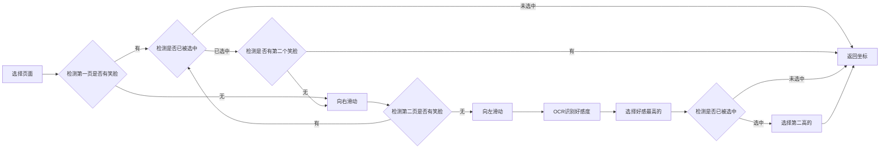
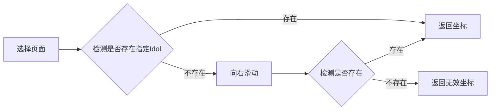

# 运行逻辑
## WorkChooseAuto

```mermaid
flowchart LR
    A[选择页面] --> B{检测第一页是否有笑脸}
    B -->|有| C{检测是否已被选中}
    B -->|无| D[向右滑动]
    C -->|未选中| E[返回坐标]
    C -->|已选中| F{检测是否有第二个笑脸}
    F -->|无| D
    F -->|有| E
    D --> H{检测第二页是否有笑脸}
    H -->|有| C
    H -->|无| I[向左滑动]
    I --> J[OCR识别好感度]
    J --> K[选择好感最高的]
    K --> L{检测是否已被选中}
    L -->|选中| M[选择第二高的]
    L -->|未选中| E
    M --> E
```

## WorkChooseIdol

```mermaid
flowchart LR
    A[选择页面] --> B{检测是否存在指定Idol}
    B -->|存在| D[返回坐标]
    B -->|不存在| C[向右滑动]
    C --> E{检测是否存在}
    E --> |存在| D
    E --> |不存在| F[返回无效坐标]
```