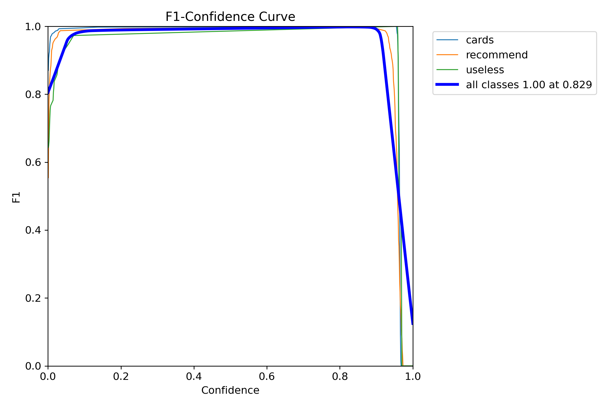
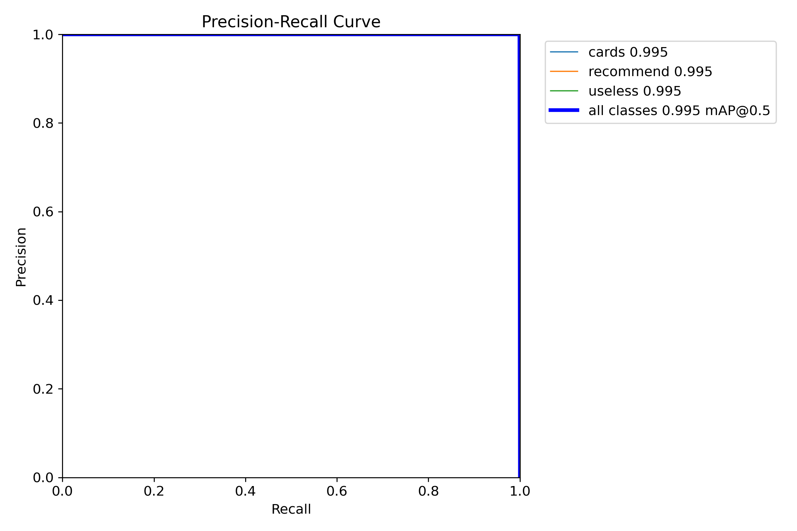
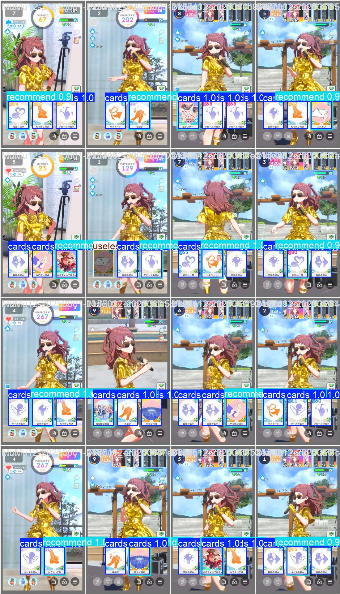

# MaaGakumasu 开发相关

MaaGakumasu 主要基于 [MaaFramework](https://github.com/MaaXYZ/MaaFramework) 框架开发。

选择 `JSON + 自定义逻辑扩展` 模式

请先阅读MFW官方文档，了解MFW的使用方法。

## 深度学习 YOLOv11 训练相关

当前 YOLOv11 主要用于 `自动培育` 的出牌识别。

模型训练参考 [MaaNeuralNetworkCookbook](https://github.com/MaaXYZ/MaaNeuralNetworkCookbook/tree/main/NeuralNetworkDetect) 官方文档。

数据集标注使用 [Roboflow](https://app.roboflow.com/gakumasu) 网站。

- `cards` 集用于识别*出牌*
- 早期用于上课、冲刺选项识别的 `button` 集已废弃，相关按钮识别已改为普通模板匹配

相关 `F1_curve.png` 和 `PR_curve.png` 如下

识别预览

> [!IMPORTANT]
> `cards` 集 目前902份样本，均已标注完成，对多卡重叠的情况进行了额外强化训练。
>
> 若您有兴趣参与标注或者提供样本，欢迎联系开发组。

截图样本建议使用 `MuMu模拟器12` 自带截图工具，分辨率为 `1280x720 (240DPI)`。
