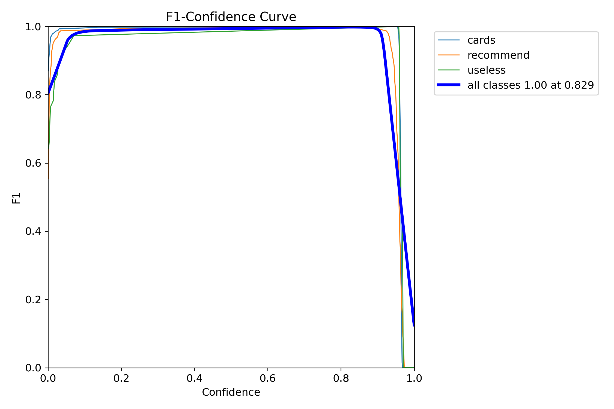
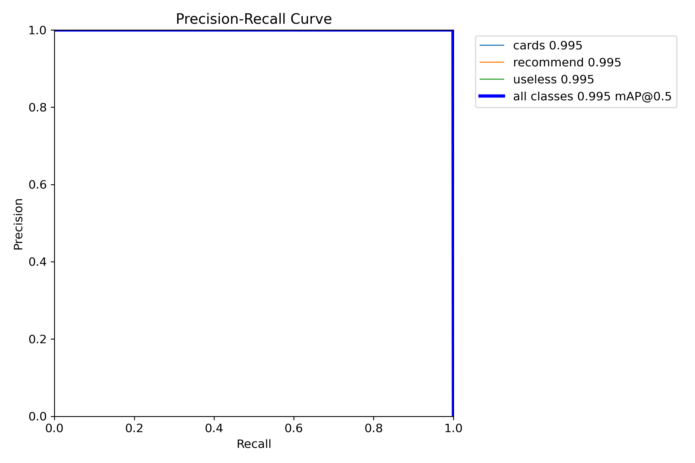
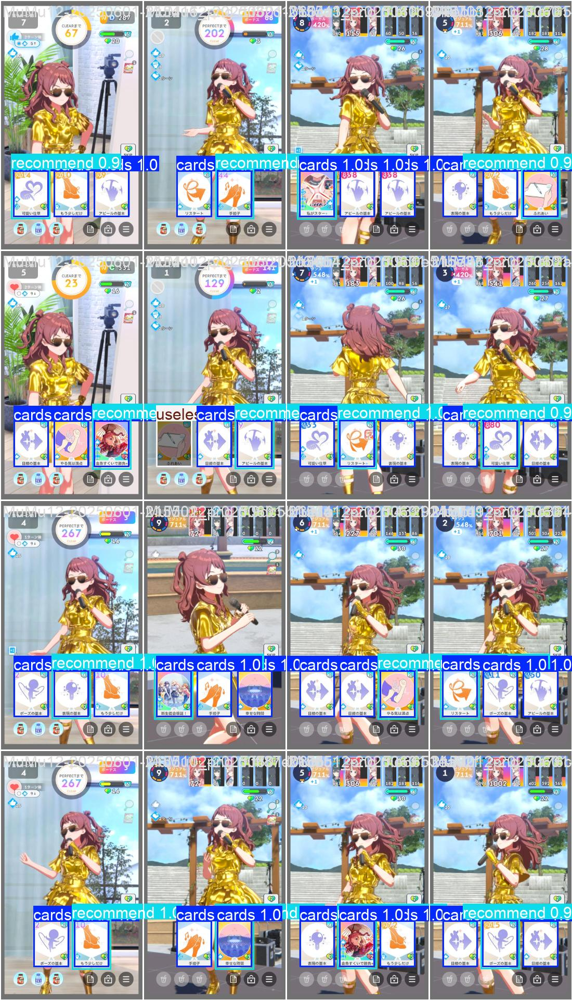

# MaaGakumasu 开发相关

MaaGakumasu 主要基于 [MaaFramework](https://github.com/MaaXYZ/MaaFramework) 框架开发。

选择 `JSON + 自定义逻辑扩展` 模式

请先阅读MFW官方文档，了解MFW的使用方法。

## 深度学习 YOLOv11 训练相关

当前 YOLOv11 主要用于 `自动培育` 的出牌识别。

模型训练参考 [MaaNeuralNetworkCookbook](https://github.com/MaaXYZ/MaaNeuralNetworkCookbook/tree/main/NeuralNetworkDetect) 官方文档。

数据集标注使用 [Roboflow](https://app.roboflow.com/gakumasu) 网站。

- `cards` 集用于识别*出牌*
- 早期用于上课、冲刺选项识别的 `button` 集已废弃，相关按钮识别已改为普通模板匹配

相关 `F1_curve.png` 和 `PR_curve.png` 如下

识别预览

> [!IMPORTANT]
> `cards` 集 目前902份样本，均已标注完成，对多卡重叠的情况进行了额外强化训练。
>
> 若您有兴趣参与标注或者提供样本，欢迎联系开发组。

### 出牌数据标注与验证

出牌模型使用互斥类别：普通可用牌标为 `cards`，推荐牌标为 `recommend`，不可用牌标为 `useless`。同一卡牌仅标一个类别；不同卡牌因遮挡产生的重叠框仍需保留。MaaFramework 会对不同类别的重叠框一起去重，因此不要在同一张推荐牌上同时标注 `cards` 和 `recommend`。

训练完成后，应通过实际使用的 MaaFramework 版本验证导出的 ONNX，确认最终检测结果，并覆盖无推荐牌、多牌遮挡、不可用牌、无手牌和动画过渡场景。训练指标不等同于实际出牌成功率。

出牌超时截图收集、候选导出和临时规则对比工具已移除。15 秒未识别到推荐牌时的兜底出牌逻辑继续保留；排查问题可保存 `debug/maa.log`，并使用模拟器截图工具收集原图，人工复核后在 Roboflow 标注。已有调试截图和训练素材不会自动删除。

截图样本建议使用 `MuMu模拟器12` 自带截图工具，出牌原图宽 720、高 1280（240DPI）；标注和验证时保持原始方向与尺寸。
