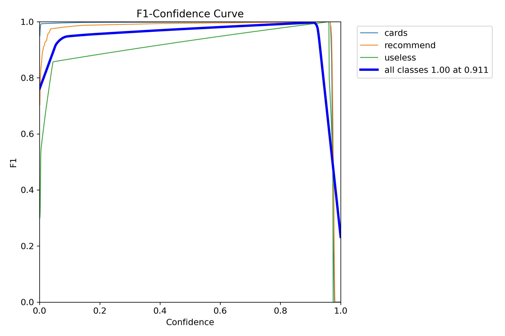
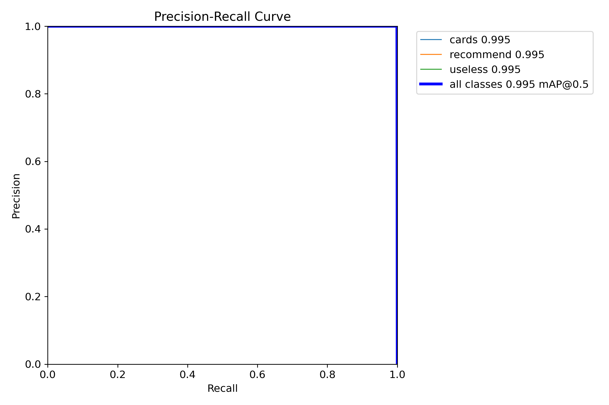
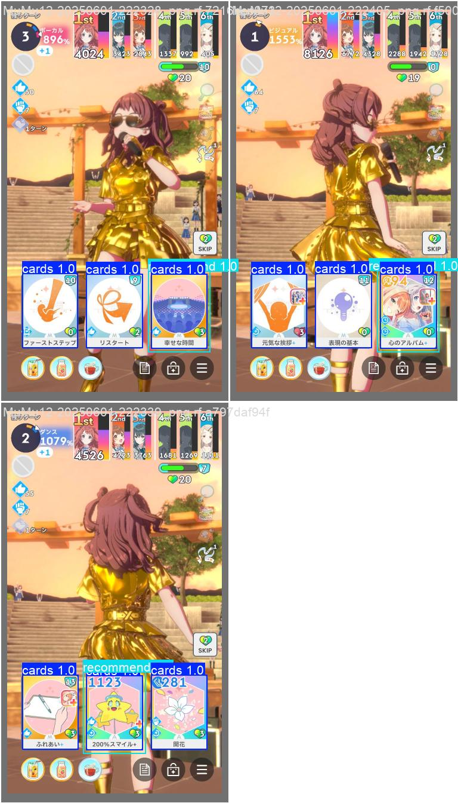
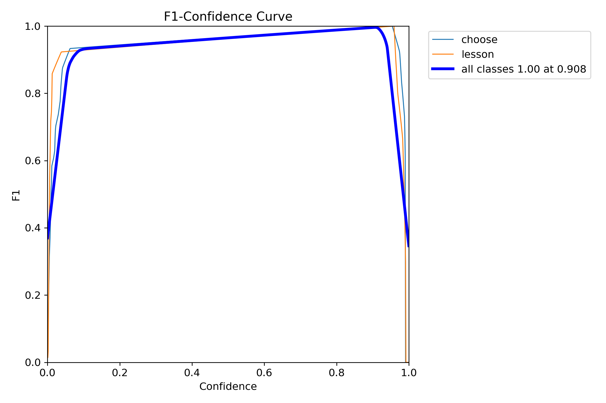
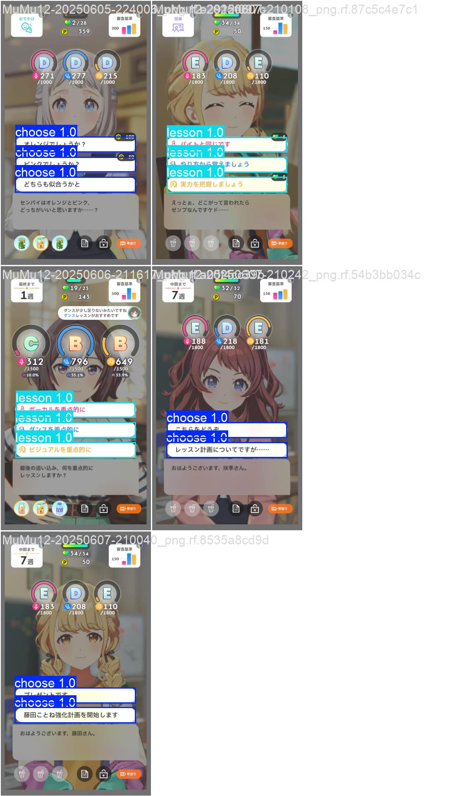
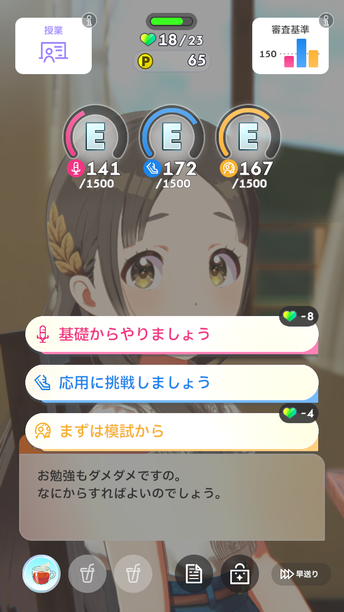

# MaaGakumasu 开发相关

MaaGakumasu 主要基于 [MaaFramework](https://github.com/MaaXYZ/MaaFramework) 框架开发。

选择 `JSON + 自定义逻辑扩展` 模式

请先阅读MFW官方文档，了解MFW的使用方法。

### 深度学习YOLOv11训练相关

主要用于 `自动培育` 相关功能

模型训练参考[MFW](https://github.com/MaaXYZ/MaaNeuralNetworkCookbook/tree/main/NeuralNetworkDetect)官方文档

数据集标注使用 [roboflow](https://app.roboflow.com/gakumasu) 网站

- `cards` 集用于识别*出牌*

相关 `F1_curve.png` 和 `PR_curve.png` 如下

识别预览

- `button` 集用于识别*上课/冲刺选项*

相关 `F1_curve.png` 和 `PR_curve.png` 如下

识别预览

> [!IMPORTANT]
> `cards` 集 目前405张样本，均已标注完成。基本满足当前需求
> 
> `button` 集 目前仅28张样本，均已标注完成。**但目前未能完全满足当前需求**，部分场景下识别率较低。
> 
> 若您有兴趣参与标注或者提供样本，欢迎联系开发组。

`button` 集 素材实例

使用 `MuMu模拟器12` 自带截图工具，分辨率为 `1280*720(240DPI)`