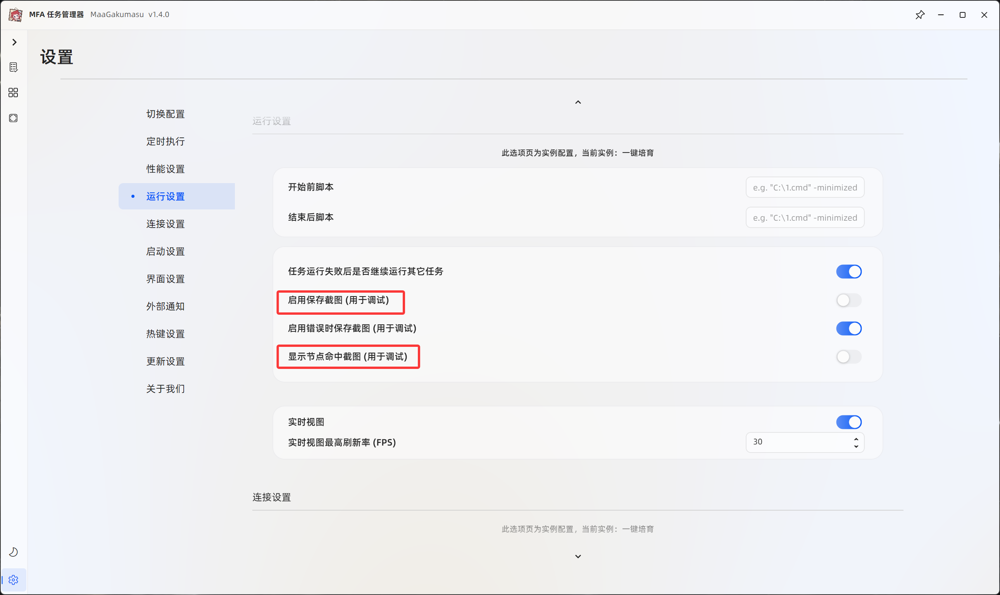
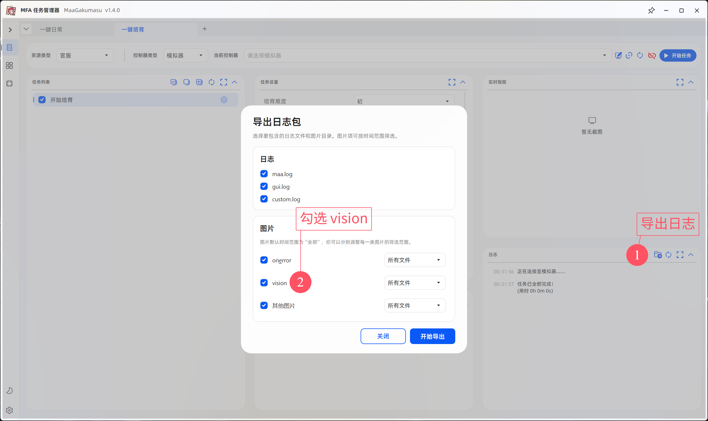

# 提问与反馈指南

在反馈问题前，请先按本文完成基础检查，并尽量提供可复现的信息。  
信息越完整，越容易判断是配置问题、环境差异、识别资源缺失，还是实际流程缺陷。

## 反馈前检查

### 版本与运行环境

- 确认正在使用 GitHub Releases 中发布的最新正式版。
- 确认游戏窗口为竖屏 `9:16`，分辨率不低于 `720P`，推荐 `960x1280` 或更高。
- 使用 DMM 版时，请确认 MaaGakumasu 已通过**管理员模式**启动。
- 使用插件版汉化时，请确认资源类型与当前游戏版本匹配。

### 功能范围

- 如果无法进入或完成培育，请先运行一次 `一键日常`。
- 如果 `一键日常` 也无法正常运行，优先排查连接、分辨率、权限和游戏版本。
- 如果 `一键日常` 正常，但培育流程卡住，请继续阅读下方的日志导出步骤。

### 培育相关注意事项

- `跳过准备阶段` 只适合在培育流程中断后继续使用。
- 如果从游戏首页重新开始培育，请不要启用 `跳过准备阶段`，否则可能无法正确进入流程。
- 插件版汉化在选择偶像时偶尔会因汉化文本异常卡住；若稳定卡在该步骤，请先确认汉化资源是否已更新。

## 需要提供的信息

反馈问题时，请尽量包含以下内容：

| 信息 | 说明 |
| --- | --- |
| MaaGakumasu 版本 | 使用的正式版版本号，或自行构建的提交号 |
| 运行平台 | Windows、macOS、Linux 或 DMM 环境 |
| 模拟器与分辨率 | 例如 MuMu 模拟器 12，`960x1280` |
| 游戏语言/资源类型 | 原版日语、插件版汉化、DMM 版等 |
| 任务配置 | 运行的任务名称，以及关键选项截图 |
| 卡住位置 | 稳定卡住的界面、按钮、弹窗或培育阶段 |
| 日志与截图 | 按下方步骤导出的调试压缩包 |


## 导出调试日志

当基础检查均通过，但任务仍然稳定卡在某个场景时，请按以下方式导出日志。

1. 在 MaaGakumasu 中启用 `启用保存截图（用于调试）` 和 `显示节点命中截图（用于调试）`。

   

2. 重新运行任务，直到复现卡住的位置。

3. 停止任务并导出日志。导出时请勾选 `vision`。

   

4. 将导出的压缩包发送到交流群文件，或在 GitHub Issues 中上传。

## 推荐反馈格式

```text
问题描述：
复现步骤：
期望结果：
实际结果：
MaaGakumasu 版本：
运行环境：
模拟器 / DMM：
分辨率：
游戏语言 / 资源类型：
相关任务配置：
已附加日志：是 / 否
```

> [!TIP]
> 如果问题能稳定复现，请说明“每次都会卡住”或“大约运行几次出现一次”。  
> 如果只在特定偶像、难度、道具、汉化资源或模拟器中出现，也请一并说明。
